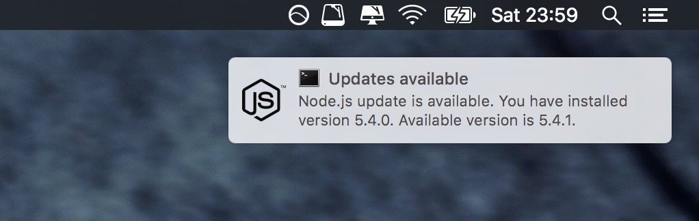

# Node.js update checker

Let's make checking for updates of Node.js more effective and interactive.
This script will show notification when new version of Node.js is available.

#### Screenshot


#### Usage
```
node app.js [OPTION]
```
```
  -s, --stable      check for stable release
  -l, --lts         check for LTS release
  -h, --help        display this help and exit
  -v, --version     output version information and exit
```
For effective use create crontab entry (depents on release version):
```
0 * * * * /usr/local/bin/node /path/to/node-version-check/app.js --stable
0 * * * * /usr/local/bin/node /path/to/node-version-check/app.js --lts
```